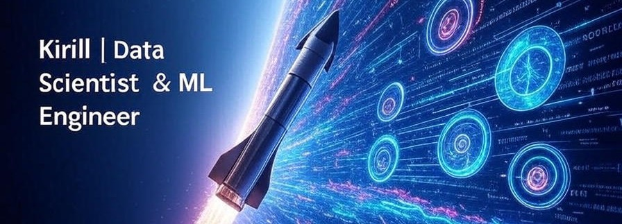

# Привет, я Кирилл  

 Data Scientist / ML Engineer / Data Analyst  

---

## О себе  
ML Engineer / Data Scientist с инженерным бэкграундом в аэрокосмической отрасли (7+ лет).

Занимаюсь разработкой end-to-end ML/CV решений: обработка данных, обучение моделей, API, deployment и интеграция сервисов. Работаю с классическим ML, нейросетями и Computer Vision.

Инженерный опыт помог сформировать системный подход к разработке, аналитическое мышление и ориентацию на практический результат. Интересуюсь production ML, MLOps и прикладными AI-системами.

---

## Стек

  <!-- Languages -->
  
  
  
  <!-- ML & DS -->
  
  
  
  
  
  
  
  
  <!-- Data & Tools -->
  
  
  
  
  
  
  <!-- Visualization -->
  
  
  
  

---

## Проекты  
- [Safer detection OCR](https://github.com/kiryall/safer-detection-ocr) - Инструмент для автоматического обнаружения объектов и распознавания текста на изображениях в полевых условиях.
- [Customer Churn Prediction](https://github.com/kiryall/data-science-projects/tree/main/project_customer_churn_forecast) – предсказание оттока клиентов (ROC-AUC = 0.868)  
- [Sentiment Analysis](https://github.com/kiryall/data-science-projects/tree/main/project_sentiment_analysis) – классификация отзывов (F1 = 0.935)  
- [HR Analytics](https://github.com/kiryall/data-science-projects/tree/main/project_HR_analytics) – прогноз удовлетворённости и оттока сотрудников  

Полный список проектов: [GitHub](https://github.com/kiryall/data-science-projects)  

---

## Контакты и соцсети  

- 📧 Email: [kiryall@yandex.ru](mailto:kiryall@yandex.ru)  
- 💬 Telegram: [@spacefarmer](https://t.me/spacefarmer)  
- 📝 Portfolio: [GitHub Projects](https://github.com/kiryall/data-science-projects)  

---

## Статус  
Открыт к предложениям: полная или частичная занятость.  
Предпочтительный формат: гибрид / удалёнка.

---
